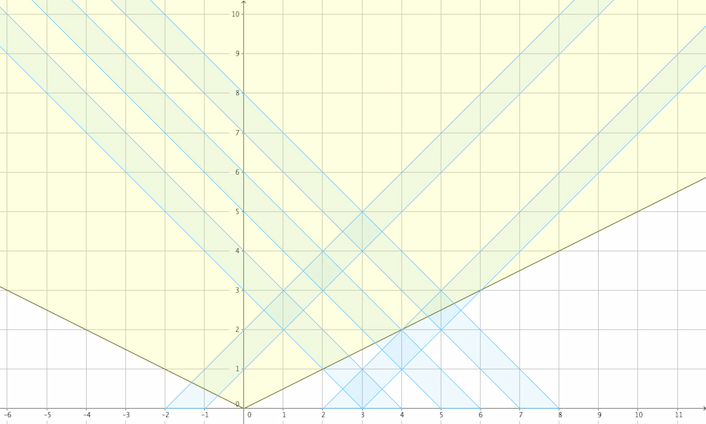

```
风吹云走
其实云是不动的
是月亮在走

这就是第一步
然后将时间作为第二轴画出来
A picture is worth a thousand words.
```
<!--more-->

然后就是拼命推公式（干了好久。。）
vector a中存向右的$x_u$
vector b中存向左的$x_v$
$$\frac{1}{w_{max}}<\frac{x_v-x_u+l}{|x_u+x_v+l|}$$
拆绝对值
1.$x_u+x_v+l>=0$,
$$x_v>\frac{x_u(w+1)}{w-1}-l$$
2.$x_u+x_v+l<0$,
$$x_v>\frac{x_u(w-1)}{w+1}-l$$
注意$x_u>=0$时只会在1.中产生贡献,且1.中不等式成立的话条件就成立
$x_u<0$时在1.和2.中都有贡献但$\frac{x_u(w-1)}{w+1}-l<\frac{x_u(w+1)}{w-1}-l$，且2.中不等式成立的话条件也成立，所以只要算2.中的贡献
也就是$x_u>=0$的话做1.
否则做2.
妙不可言

当然如果注意到有单调性。。随便切了
```cpp
#include<bits/stdc++.h>
#define mp make_pair
#define pb push_back
using namespace std;
typedef long long LL;
typedef pair<int,int> PII;
inline LL read()
{
	LL x=0,f=1;char ch=getchar();
	while(ch<'0'||ch>'9'){if(ch=='-')f=-1;ch=getchar();}
	while(ch>='0'&&ch<='9'){x=(x<<1)+(x<<3)+(ch^48);ch=getchar();}
	return x*f;
}
int n,l,w;
int x,t;
vector<LL> pos,neg;
vector<LL>::iterator it,tmp;
LL ans;
int main()
{
	n=read();l=read();w=read();
	for(int i=1;i<=n;++i){
		x=read();t=read();
		(t==1?pos:neg).pb(x);
	}
	sort(neg.begin(),neg.end());
	for(it=pos.begin();it!=pos.end();++it){
		x=*it;
		if(x>=0){
			if(w>1){
				ans+=neg.end()-upper_bound(neg.begin(),neg.end(),double(1ll*x*(w+1))/(w-1)-l);
			}
		}
		else{
			ans+=neg.end()-upper_bound(neg.begin(),neg.end(),double(1ll*x*(w-1))/(w+1)-l);
		}
	}
	printf("%lld",ans);
	return 0;
}
```
```cpp
#include<bits/stdc++.h>
#define mp make_pair
#define pb push_back
using namespace std;
typedef long long LL;
typedef pair<int,int> PII;
inline LL read()
{
	LL x=0,f=1;char ch=getchar();
	while(ch<'0'||ch>'9'){if(ch=='-')f=-1;ch=getchar();}
	while(ch>='0'&&ch<='9'){x=(x<<1)+(x<<3)+(ch^48);ch=getchar();}
	return x*f;
}
const int N=100008;
int n,l,w;
int x,t,t1,t2;
int x1[N],x2[N];
LL ans;
int main()
{
	n=read();l=read();w=read();
	for(int i=1;i<=n;++i){
		x=read();t=read();
		if(t>0)	x1[++t1]=x;
		else	x2[++t2]=x;
	}
	sort(x1+1,x1+t1+1);
	sort(x2+1,x2+t2+1);
	t=1;
	for(int i=1;i<=t1;++i){
		while(t<=t2&&(abs(x1[i]+x2[t]+l)>=1ll*w*(x2[t]-x1[i]+l))){
			++t;	
		}
		ans+=t2-t+1;
	}
	printf("%lld",ans);
	return 0;
}
```