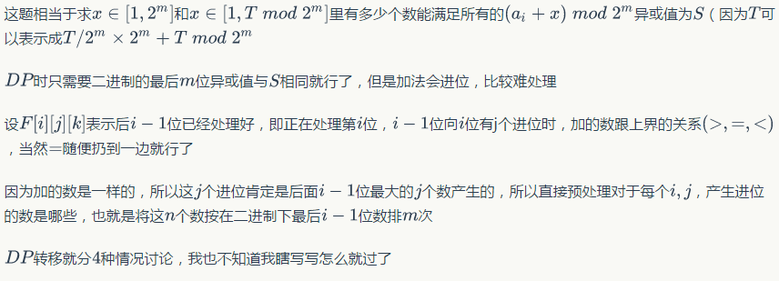

title: zr模拟赛
tag: 心情
---
考试的首要目标：得高分！
不写对拍的话，一半概率会炸。

# 提高r1
第一题找规律，40min完成
第二题基环内向树，写了挺久，建了反向边dfs。其实拓扑或者tarjan都行。1.5h才写完
第三题没什么思路，打了暴力。
期望100+100+50=250
实际100+100+40=240
第三题应该是n>20是特判，结果写成n>100，有10分t了。

t3正解：
应该想到区间dp，但是很难想到维护什么
因为很杂乱
首先要枚举出是哪个字符串p，复杂度 $\sum_{len|n}(n-len+1)$

dp[i][j]表示
* 若j-i+1是len的倍数，则dp[i][j]=[能否消完]
* 若j-i+1不是len的倍数，则dp[i][j]=[是否能消成p的前缀]，注意到这个前缀是固定的，可以通过长度算
转移：
* 考虑往区间后面加一个字符，$dp[i][j]=dp[i][j-1]&s[j]==prefix((j-i)%len+1)$
* 考虑往区间前面加一段字符，$dp[i][j]=dp[i][j-k*len]&dp[j-k*len+1][j]$

这样就可以考虑到所有的情况，向后加一段可以通过一个一个加得到，向前加一个可以通过改变i得到。
注意初始化：dp[i][i-1]=1，其他为0

# 提高r5 18-9-22
找规律真有趣

# 提高r7 18-10-13
第一题
相当于01覆盖问题
然而这个问题并不可做
但是n>=m^2且数据随机
所以可以认为图是连通的。。
卡了2h。。

第二题
树上随机游走+树上最长路
最可做的一题吧
考完试1minac

第三题
数学+推式子
不是很擅长啊
看完题解觉得挺简单的
暴力写炸了
心态爆炸加写炸
对1和2的状态写错了（小状态一定要写对啊，那大状态的程序跑一下也行啊。。）
还有tarjan写的丑
st和ins什么的最好都清空！！
数组不要只开大1！！（sta[ta+1]!=x，这样爆了！！）

# 提高r8 18-10-20
心态不能崩，暴力不能挂‘
打好暴力就rk10了！！

第一题暴力挂+第二题暴力挂
艹

第一题
a[i]写成i

第二题
递归的变量和全局变量重了

wtf!
这种错误静态查错应该能查出来的！！
以后模拟赛不管怎样都要静态查错，包括暴力！！

# 提高r9 18-10-27
第一题
还是逻辑不够严谨
证明的东西还是要写下来才严谨啊
在cpp开头写倒是不错

第二题
容斥
（我容斥好差啊

第三题
毒瘤题
好好读题，不要被长题面吓到了


# 普转提r1 18-9-9
第一题
二分加滑动窗口
被精度卡到死
对拍了好久
不停的调eps
实际上什么都没卡。。

第二题
贪心
dp
随便
dp：记录每个左端点最近的右端点，f[r[i]]=max(f[r[i]],f[i]+1),f[i+1]=max(f[i+1],f[i])
贪心：
- 遇到一个右端点，假如这个区间还有效，++ans，将目前遇到的所有区间置为无效
- 遇到一个左端点，使这个区间有效

第四题
心中有边的时候（就是你知道应该访问哪些点的时候）
可以不建边，节约时间空间
把这题暴力*掉。

正解是优化建图（你胡思乱想哪些倍增有甚么用）
把每个点的高度再作为1维
变成n^3的点数和边数，上dijk就行

# 普转提r2 18-9-16
第一题
注意到交换两个数之和左右两边就分开了
按区间考虑
一旦区间的左右位置确定了，区间中有哪些数就确定了
这样就可以dp[l][r]表示将[l,r]排成递增的顺序有多少种方法
枚举中间的转移点就可以了
记忆化搜索
判断转移合法的方式（也就是[l,i]中恰好含有[l,i]）：
用cnt[i]记录从l到i有多少个数在[l,i]
合法<=>cnt[i]==i-1&&((cnt[i+1]==i&&a[i]!=l+i)||(cnt[i+1]==i+1&&a[i]==l+i))
O(n^3)

第二题
有2^(R+C)的贡献
相当于每个子集有1的贡献
相当于求每个集合被多少个集合包含
先枚举包含的行列数，令$t=i*m+j*n-i*j$
相当于长度为n的格子，往里面填m个数，再选择k个数，使得前t个格子被选中

$ans=\sum_{i=0}^{n}\sum_{j=0}^{m}C_n^i*C_m^j*F$
其中F表示满足i行j列的概率
$$F=\frac{A_m^{n^2}*C_{m-k}^{k-t}}{A_m^{n^2}*C_{m}^{k}}$$
分母表示总方案数
分子表示满足条件的方案数
总体考虑分子（而不是对某种选完k个数的方案进行考虑）
对某个排列，它可以对应的方案数是$C_{m-k}^{k-t}$
或者暴力的算
先钦定选数和t个数，再算上排列
$$C_m^t*C_{m-k}^{k-t}*t!*A_{m-t}^{n^2-t}=A_m^{n^2}*C_{m-k}^{k-t}$$

第三题
相当于中序遍历的序列单调上升
最小化修改次数相当于最大化不修改数（重要的思想：补集！！）
注意到lis
但是两个数中间不一定能放下这么多数
如果是求单调不降的序列就比较简单，直接求原序列的单调不降的序列
但是单调不降和单调上升还是很容易转化的
让a[i]-=i即可
（其实也可以理解为在严格单增问题中能拓展的条件为$a[i]-a[k]\geq i-k$那么也就是$a[i]-i\geq a[k]-k$）

第四题
显然ak是区间的最小值且其他数都是它的倍数
找l，r即可

# 普转提r3 18-9-23
第一题
思维题
好好观察题目性质

第二题
发现桥的板子是写假了。
不能记fa，因为有重边！！
其实建图也假了
要正反各跑一遍dijk

第三题
数位的题目
要以二进制的眼光看数
加一个数就是在每位加0或1
fi,j表示处理到第i位（从右往左的第i位以左已经处理完），第i-1位有j个数进位了
考虑第i位加的是0还是1，O1转移


第四题
n^2logn应该要想到
然后要注意到可以拿当前值先判一下，这个剪枝很强，可以直接a掉
某奇怪性质：
- 随机序列的lis的长度的期望是2sqrt(n)的（有论文）
- 长度为n2+1的排列至少有一个长为n+1的上升子序列或下降子序列（证明：dp是说以每个数结尾的最长上升子序列长度和最长下降子序列长度 对于两个数而言两者不能都一样 所以要是都在1-n就最多有n2个数 from ytl）
- 长度为n的排列，设它的最长上升子序列长度为a，最长下降子序列长度为b，则ab>=n（证明：这n个位置的dp值都不一样，在二维坐标系下表示这些点，ab最小的时候一定是这些点围成一个矩形，矩形的长乘宽就是ab，所以ab>=b）
- 随机序列的不同前缀最大值个数是（调和级数）ln(n)的（证明：因为第i个数有1/i概率比之前的都大 所以根据期望的线性性加起来就是ln）


将顺序随机一下，只有log个位置需要进去二分，其他位置只要判掉就行
复杂度O(n^2+nlognlogn)

# 普转提r4 18-9-30
第一题
数学
线性筛因数个数（暴力卡时过。。）

第二题
分类讨论
knight's tour：
n*n中，n>=5存在哈密尔顿路径，n>=6且n为偶数存在哈密尔顿回路（证明见wiki）
n*m中，只要min(n,m)>=5则存在哈密尔顿路径，无证明（搜索证明。。

第三题
暴力加最优性剪枝暴艹正解
正解二分+扫描线+set

第四题
暴力r和m打错。。
常用变量名还是不要乱动。。
转对偶图+并查集


# 普及r3 18-9-29

你oi比赛当然要好好检查啊	from fizzydavid

第一题
sb题
sb题也要仔细做！！
想清楚再写！！

第二题
人眼查错
不是用眼睛查错
是用脑子查错！！

这才是优秀的写法
```cpp
double Calc(int x) {
	if (x == 4) return s[x];
	if (f[x] <= 2) {
		if (f[x] == 1) s[x + 1] *= s[x];
		if (f[x] == 2) s[x + 1] = s[x] / s[x + 1];
		return Calc(x + 1);
	}
	else {
		if (f[x] == 3) return s[x] + Calc(x + 1);
		if (f[x] == 4) return s[x] - Calc(x + 1);
	}
}
```

round：取离自己最近的整数（四舍五入），0.5的话取远离0的值
trunc：舍弃小数
floor：小于等于的最大整数
ceil：大于等于的最小整数
int()和LL()这种强制类型转换等同于trunc
判断x是否是整数：fabs(x-round(x))<eps
fabs可以用
abs(int)可以用
abs(LL)最好自己写
```cpp
/* round vs floor vs ceil vs trunc */
#include <stdio.h>      /* printf */
#include <math.h>       /* round, floor, ceil, trunc */

int main ()
{
  const char * format = "%.1f \t%.1f \t%.1f \t%.1f \t%.1f\n";
  printf ("value\tround\tfloor\tceil\ttrunc\n");
  printf ("-----\t-----\t-----\t----\t-----\n");
  printf (format, 2.3,round( 2.3),floor( 2.3),ceil( 2.3),trunc( 2.3));
  printf (format, 3.8,round( 3.8),floor( 3.8),ceil( 3.8),trunc( 3.8));
  printf (format, 5.5,round( 5.5),floor( 5.5),ceil( 5.5),trunc( 5.5));
  printf (format,-2.3,round(-2.3),floor(-2.3),ceil(-2.3),trunc(-2.3));
  printf (format,-3.8,round(-3.8),floor(-3.8),ceil(-3.8),trunc(-3.8));
  printf (format,-5.5,round(-5.5),floor(-5.5),ceil(-5.5),trunc(-5.5));
  return 0;
}
value   round   floor   ceil    trunc
-----   -----   -----   ----    -----
2.3     2.0     2.0     3.0     2.0
3.8     4.0     3.0     4.0     3.0
5.5     6.0     5.0     6.0     5.0
-2.3    -2.0    -3.0    -2.0    -2.0
-3.8    -4.0    -4.0    -3.0    -3.0
-5.5    -6.0    -6.0    -5.0    -5.0
```

第三题
推推性质

第四题
有点坑的模拟
t4...你想清楚再写....也不会错的那么离谱啊 from fizzydavid
一开始没注意到只有弹音符的时候才会调音量
然后循环中的8打成n（这个错误调了很久。。以后出错了请先静态查错！！）
最后时刻发下来的大样例炸了
考完发现是一个变量名打错了（脑子不清爽，这个时候重开一个cpp，把调试代码删掉，一部分一部分看）

# 十一r1 18-10-2
第一题
数学题（17年之后的模拟赛t1都是要动脑筋的数学题了？）
推推推 拍拍拍

第二题
挺好想的
就是卡空间卡时间
发现最多只有深度大小，可以优化空间（空间优化的同时也优化了时间）
vector的resize是个好东西
卡成90差评。。（输入较大且卡常的时候考虑fread！！）

第三题
暴力没有memset
就算是暴力也不能随便应付
要仔细写
（没事了不要浪好好检查，又想起了“你oi比赛当然要好好检查啊”	from fizzydavid）

期望得分：100+100+20=220
实际得分：100+90+0=190

# 十一r2 18-10-4

第二题
（打表都不开O2吗 from dls）
（打表要早跑啊	from dls）
n<=5的点n=1的写错了，然而数据就是1..

爆搜无标号的树（爆搜树形态），不可写。

有根树和无根树就是*/n

有标号树和无标号树？

第三题
不要的点是独立集！！（没有抽象出这个结论）
二分图的最大权独立集等于总权值-最大权匹配（最小割/最大流）

# 停课训练r6 18-10-22
第一题
我的贪心想的是假的。。
反例：
20
acabcccccacccbccccaa
bababcbcabcbbccaccbb
正确的做法：
逐位确定
字符串A和字符串B相当于一个匹配
只要网络流能跑满流就是有解
判断这个网络流能跑满可以O(字符集大小k)判
s1[0]<=s2[1]+...+s2[k] <=> s1[0]<=len-s2[0]
s1[1]<=len-s2[1]
...
s1[k]<=len-s2[k]
hall定理可以证明以上 或 网络流最小割证明
维护s1[i]+s2[i]，复杂度O(nk+klogk)

第二题
改成gcd恐怕就不可做了
改成异或可以nloglog

$\frac{P}{N}\times N+P\times(2\ln N-\ln P)$


# A new start! 前面的坑无限期拖延
# 省选r1 18-12-2
上来就开t3是不是很错误呢。。
还是应该三题都先看
（不过t3好像最好写
t1不会
t2不会
t3不会
做题顺序出锅了吧。。
t1公式写错。。（调了好久
t2强行凑样例得10分（~~不凑能得15分~~）
t3阶乘求小了（涉及求值的注意数组下标的范围啊！！）

t1转化成求凸包很妙啊
get求凸包新方法：求上下凸壳（排序更好写）
cross<eps就弹掉（否则会有很多重复的点，可能会爆数组）
排序用atan2就会很慢
x相同按y排序，叉积为0也要弹栈

双调路径也很妙啊（n^2），这需要确定一个点在环上

t2差分之后贪心+dp

t3前缀和的迭代，每个值的贡献是组合数！（终于知道了，卡了我好久）
然后就是组合数的展开！（暴力展开n^3）


